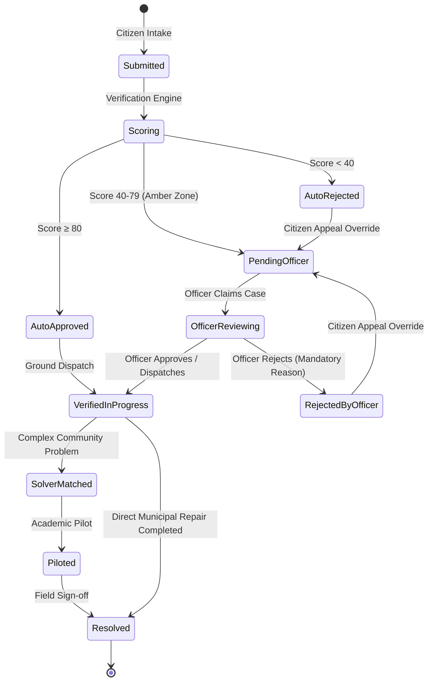

# SamadhanSetu Domain Context

> **SamadhanSetu (समाधान सेतु)** is the Sovereign Civic Grievance Redressal and Academic Solver Exchange for the Government of Jharkhand (SIH 2026 Problem Statement 043).

---

## 1. Domain Glossary (Ubiquitous Language)

| Term | Definition | Avoid Calling It |
| :--- | :--- | :--- |
| **Grievance** | A formal citizen-submitted report describing a civic infrastructure defect, environmental hazard, public service breakdown, or administrative irregularity. Identified by an authoritative tracking code (`SS-YYYY-NNNNNN`). | "ticket", "bug", "task", "item" |
| **Citizen** | An authenticated or guest resident of Jharkhand submitting grievances, providing photographic evidence, or filing appeals. | "user", "client", "reporter" |
| **District Nodal Officer** | An administrative official assigned to one of Jharkhand's 24 districts (DWSD, RCD, Municipal Corporation, JPSC) authorized to inspect, approve, reject, or dispatch grievances. | "admin", "moderator", "manager" |
| **Verification Engine** | An authoritative server-side evaluation pipeline that scores grievances from 0–100 across 6 signals (text coherence, duplicate detection, geo-consistency, submitter history, category match, media presence) and recommends auto-approval, officer review, or auto-rejection. | "AI bot", "filter", "checker" |
| **Public Tracking ID** | A sovereign formatted identifier: `SS-YYYY-NNNNNN` (e.g. `SS-2026-000481`), normalized across all search and tracking interfaces. | "UUID", "ID", "slug" |
| **Appeal Override** | A citizen's procedural right to overturn an auto-rejection or officer determination by furnishing supplementary geotagged proof, forcing mandatory nodal review. | "reopen", "retry" |
| **Solver Team** | An interdisciplinary academic or industry group (e.g., from BIT Mesra, IIT ISM Dhanbad, NIT Jamshedpur) matched to complex recurring grievances to formulate pilot solutions and engineering tenders. | "dev team", "group", "workers" |
| **Challenge Board** | The public directory of verified, high-urgency civic challenges available for university solvers and CSR consortiums. | "feed", "list", "board" |
| **Resolution Vector** | The verified deployment artifacts and entry points ensuring synchronous UI delivery across SPA routes, static CDN mirrors, and serverless endpoints. | "build outputs", "pages" |

---

## 2. Core Entities & Lifecycle

---

## 3. Architectural Seams & Invariants

1. **Intake Seam (`GrievanceRegistry`)**:
   - Every civic problem enters through a unified intake schema with explicit District, Block, Category, Coordinates, and Media Evidence.
2. **Authoritative Verification Seam (`VerificationEngine`)**:
   - Authenticity scores are never trusted from client payloads. The server strictly executes the 6-factor composite algorithm and writes immutable audit entries.
3. **Appeals & Nodal Officer Seam**:
   - Rejections require an explicit, public-facing reason.
   - Any citizen appeal immediately reopens the docket into the active nodal officer queue.
4. **Solver & Academic Collaboration Seam**:
   - Solved dockets can transition into structured innovation projects (`ProjectTeam`) with university milestones and CSR sponsorship.
5. **Zero-Dependency Static Packaging Seam**:
   - Production web assets must build cleanly via standard library Node (`fs.cpSync`, `build.js`) without reliance on brittle devDependencies.
